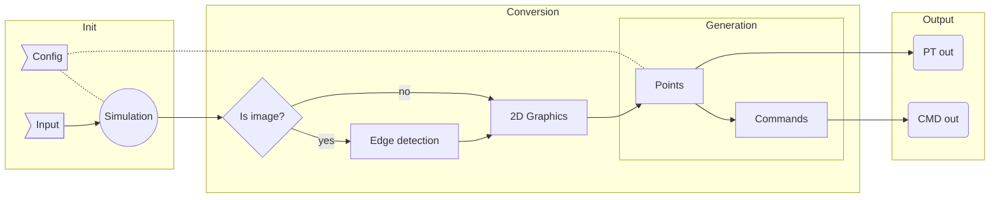

# (16) Image / Graphics Shapes to (x, y) converter

## Preface

**Task title:**

```text
Program pentru comanda 
unui utilaj cu comanda 
numerica 
```

**Task description:**

```text
- se va scrie un program pentru o masina 
de taiat cu flama 
- programul citeste un fisier care contine 
traiectoria de taiere (secventa de segmente 
si arce de cerc) si genereaza comezni 
pentru deplasarea pe doua directii (x si y) 
a capului de taiere; deplasarea capului de 
taiere se va simula pe ecranul 
calculatorului 
(Java, C, C++, C# etc.) 
```

| Editor details:   |                      |
| ----------------- | -------------------- |
| **Author**        | `Virghileanu Teodor` |
| **University**    | `UTCN CTI EN`        |
| **Year of study** | `3`                  |

<table>
<tr>
<td></td>
<td>
<ul>
<li><a href="https://github.com/GaussianWonder">Git</a></li>
<li><a href="https://github.com/GaussianWonder/scs-project">Repo</a></li>
<li><a href="https://raw.githubusercontent.com/GaussianWonder/osu-utility/main/assets/qrcode_github.com.png">QR image URL</a></li>
</ul>
</td>
</tr>
</table>

<div class="page"/>

## Contents

- [(16) Image / Graphics Shapes to (x, y) converter](#16-image--graphics-shapes-to-x-y-converter)
  - [Preface](#preface)
  - [Contents](#contents)
  - [**Introduction**](#introduction)
    - [**Context**](#context)
    - [**Specification**](#specification)
    - [**Objectives**](#objectives)
      - [Bonus objective](#bonus-objective)
  - [Bibliographic Study](#bibliographic-study)
    - [Image Processing](#image-processing)
      - [**OpenCV relevant API:**](#opencv-relevant-api)
      - [**Edge detection**](#edge-detection)
      - [**Convex hulling**](#convex-hulling)
    - [2D Primitives](#2d-primitives)
    - [Programming language](#programming-language)
      - [**RUST**](#rust)
  - [**Analisys**](#analisys)
  - [**Design**](#design)
  - [**Implementation**](#implementation)
  - [Testing and Validation](#testing-and-validation)
  - [**Conclusions**](#conclusions)
  - [Bibliography](#bibliography)

<div class="page"/>

## **Introduction**

### **Context**

The goal of this project is to **design and implement an algorithm** that **converts** *an image* or *a set of graphical shapes* **into a set of commands** that can be used by machines which work on 2D planar workspaces such as:

- Milling and Engraving machines
  - PCB prototype makers
- Plasma cutting machines
- 3D printers
- Drawing machines :)

This algorithm should be written and packed such that **it runs on relevant platforms** without the need of language specific *adaptations*

The **output** of the algorithm should be **encoded simple** enough such that it can be *repurposed / transpiled / decoded* easily in order to match the language the user's machine is using.
<sub>(**ie:** via regex transformations or content interpretation)</sub>

### **Specification**

The algorithm will be **simulated** in a *configurable* **simulation** that accepts similar commands to the output of the algorithm.

### **Objectives**

The objective of this project is to **design and implement an algorithm** that **converts** *high level graphical content* into *simple commands* that draw outlines of the given graphical abstractions.

Because of the given specification, an implementation of a configurable simulator is required.

<br />

#### Bonus objective

Given enough time, implement **a configurable slicing algorithm** for *3D objects* and sequentially pipe them into the main algorithm described above to further demonstrate its usability.

<div class="page"/>

## Bibliographic Study

Since the topic of this project is `converting images or 2d primitives` into a set of 4 directional move commands, the first thing I research is `image processing` and `2d primitives` such that project requirements can be established.

### Image Processing

From previous experience i know that [OpenCV](https://opencv.org/) is a helpful framework in this regard.

Documentation can be found [here](https://docs.opencv.org/) and the github page [here](https://github.com/opencv/opencv)

#### **OpenCV relevant API:**

- Detecting outlines via [cv::findContours](https://docs.opencv.org/4.5.3/df/d0d/tutorial_find_contours.html)
- Detecting shapes via [cv::convexHull](https://docs.opencv.org/4.5.3/d7/d1d/tutorial_hull.html)

For this purpose alone, OpenCV is overkill, so any other solutions that solve these problems in particular are well fitted, however implementation time must also be considered.

#### **Edge detection**

The [Canny Edge Detector](https://en.wikipedia.org/wiki/Canny_edge_detector) is an algorithm that solves this particular problem.

**High Level steps:**

- Grayscale Conversion
- Noise reduction / Blurring
  - [Gaussian Blur](https://datacarpentry.org/image-processing/06-blurring/)
  - [OpenCV example](https://docs.opencv.org/4.5.3/dc/dd3/tutorial_gausian_median_blur_bilateral_filter.html)
- Determining Intensity Gradients
  - Detect edge intensity and direction by using edge detection operators
  - [Sobel operator](https://en.wikipedia.org/wiki/Sobel_operator)
- Non-Maximum Suppresion
  - This can be thought out as the thinning of the currently calculated outlines
- Double Thresholding
  - Filter out pixels by intensity
    - Strong
    - Weak
    - Non relevant :)
- Edge Tracking by Hysteris
  - Transform weak pixels into strong ones
- Cleanup
  - Iterate throguh remaining weak edges and remove them

Articles that target this approach can be found [here](https://towardsdatascience.com/canny-edge-detection-step-by-step-in-python-computer-vision-b49c3a2d8123) and [here](https://justin-liang.com/tutorials/canny/)

There are other algorithms that can acomplish this as well, such as the `Scharr filter` and `Sobel filter`

#### **Convex hulling**

Although not necessary, it can be of use when debugging or for future features.

> This is currently marked as not a requirement

<div class="page"/>

### 2D Primitives

**The list of 2D Graphics Primitives is pretty narrow:**

- Point
- Line
  - > 1st degree curve
- Polygon
- Ellipse
- Curve
  - Handy list of algebraic curves can be found [here](https://www.2dcurves.com/)
  - [Bézier curve](https://en.wikipedia.org/wiki/B%C3%A9zier_curve)
    - Examples of this can be found on [p5.js source](https://github.com/processing/p5.js/) guided by [it's documentation](https://p5js.org/reference/)
    - Calculating the [bounding box](http://nishiohirokazu.blogspot.com/2009/06/how-to-calculate-bezier-curves-bounding.html)
  - [Centripetal Catmull–Rom spline](https://en.wikipedia.org/wiki/Centripetal_Catmull%E2%80%93Rom_spline)

> I did not include particular shapes of other listed items (such as triangles, rectangles,... which derive from polygons, circles which can be generated from ellipses,...)

### Programming language

The second most important thing is the `programming language` that powers the whole system.

The algorithm that performs the conversion must be a standalone that works with commandline arguments in order to fit some criterias specified during the [**Introduction**](#introduction). Because of this, it does not matter what language I use for this part of the system, as long as algorithmic requirements established during the [Bibliographic Study](#bibliographic-study) are also met.

Eventhough the simulation is not tied in any way to the algorithm mentioned above, I want both of them to be constructed using the same language and resources.

As far as the `Simulator` is concerned, I want it to live in a powerful, fast environment capable of creative graphics
<sub>via any means available (ie: OpenGL)</sub>

**`Memory safety` and `Thread safety`** are important for this specific tasks. Given the generic nature this has to be implemented in, it follows that it should support batch processing in order to be included in other systems.

#### **RUST**

> A language empowering everyone to build reliable and efficient software.

[Rust](https://www.rust-lang.org/learn) is matching the given criterias so far. [Docs](https://www.rust-lang.org/learn) are [here](https://doc.rust-lang.org/book/)

| Requirement           | Resource                                                                                         | Info                       | Targeted feature                                 |
| --------------------- | ------------------------------------------------------------------------------------------------ | -------------------------- | ------------------------------------------------ |
| Graphics              | [nannou](https://github.com/nannou-org/nannou)                                                   | Safe, Reliable, Sufficient | [2D Primitives](#2d-primitives)                  |
| Image Processing      | [opencv-rust](https://github.com/twistedfall/opencv-rust)                                        | Unstable, Untested         | [**OpenCV relevant API:**](#opencv-relevant-api) |
| Image Processing      | [rust-cv](https://github.com/rust-cv/cv)                                                         | New, Has Edge detection    | [**Edge detection**](#edge-detection)            |
| Statically typed      | [types](https://doc.rust-lang.org/book/ch03-02-data-types.html)                                  | ✓                          | [Programming language](#programming-language)    |
| Memory Safe           | [ownership](https://doc.rust-lang.org/book/ch04-00-understanding-ownership.html)                 | ✓                          | [Programming language](#programming-language)    |
| ~~Garbage Collector~~ | [bamboozle](https://blog.akquinet.de/2020/10/09/yes-rust-has-garbage-collection-and-a-fast-one/) | ✓, Not a runtime GC        | [Programming language](#programming-language)    |

<div class="page"/>

## **Analisys**



<div class="page"/>

## **Design**

<div class="page"/>

## **Implementation**

<div class="page"/>

## Testing and Validation

<div class="page"/>

## **Conclusions**

```text
[...]
```

<div class="page"/>

## Bibliography

```text
[...]
```