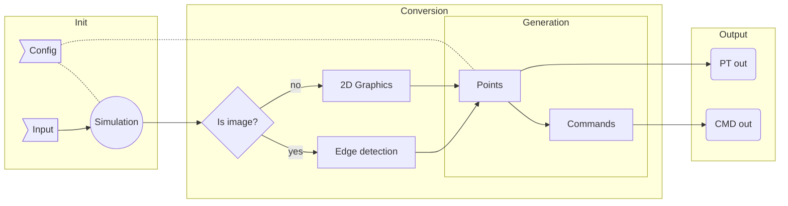
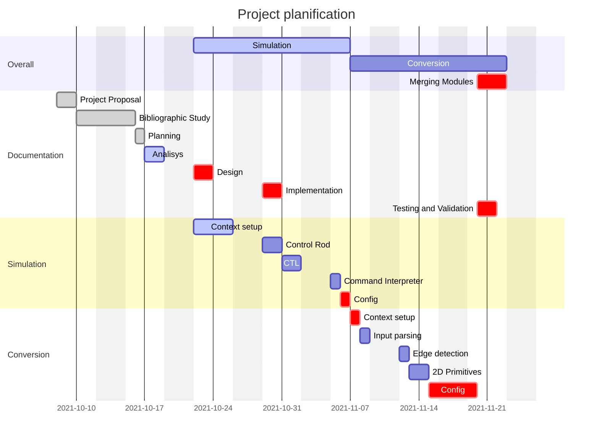

# (16) Image / Graphics Shapes to (x, y) converter

The [Standalone Conversion](converter/README.md) program has an independent documentation that can be found [here](converter/README.md).

The [CNC Simulation](simulator/README.md) has an independent documentation that can be found [here](simulator/README.md).

## Preface

**Task title:**

```text
Program pentru comanda 
unui utilaj cu comanda 
numerica 
```

**Task description:**

```text
- se va scrie un program pentru o masina 
de taiat cu flama 
- programul citeste un fisier care contine 
traiectoria de taiere (secventa de segmente 
si arce de cerc) si genereaza comezni 
pentru deplasarea pe doua directii (x si y) 
a capului de taiere; deplasarea capului de 
taiere se va simula pe ecranul 
calculatorului 
(Java, C, C++, C# etc.) 
```

| Editor details:   |                      |
| ----------------- | -------------------- |
| **Author**        | `Virghileanu Teodor` |
| **University**    | `UTCN CTI EN`        |
| **Year of study** | `3`                  |

<table>
<tr>
<td></td>
<td>
<ul>
<li><a href="https://github.com/GaussianWonder">Git</a></li>
<li><a href="https://github.com/GaussianWonder/scs-project">Repo</a></li>
<li><a href="https://raw.githubusercontent.com/GaussianWonder/osu-utility/main/assets/qrcode_github.com.png">QR image URL</a></li>
</ul>
</td>
</tr>
</table>

> I suggest reading the PDF version of this README here <https://github.com/GaussianWonder/scs-project/blob/main/README.pdf>

<div class="page"/>

## Contents

- [(16) Image / Graphics Shapes to (x, y) converter](#16-image--graphics-shapes-to-x-y-converter)
  - [Preface](#preface)
  - [Contents](#contents)
  - [**Introduction**](#introduction)
    - [**Context**](#context)
    - [**Specification**](#specification)
    - [**Objectives**](#objectives)
      - [Bonus objective](#bonus-objective)
  - [Bibliographic Study](#bibliographic-study)
    - [Image Processing](#image-processing)
      - [**OpenCV relevant API:**](#opencv-relevant-api)
      - [**Edge detection**](#edge-detection)
      - [**Convex hulling**](#convex-hulling)
    - [2D Primitives](#2d-primitives)
    - [Programming language](#programming-language)
      - [**RUST**](#rust)
  - [**Analisys**](#analisys)
    - [**Command output**](#command-output)
    - [**Config options**](#config-options)
  - [**Design**](#design)
  - [**Implementation**](#implementation)
    - [Conversion](#conversion)
    - [Simulator](#simulator)
  - [Testing and Validation](#testing-and-validation)
    - [I/O](#io)
    - [Point conversion](#point-conversion)
  - [**Conclusions**](#conclusions)
  - [Bibliography](#bibliography)

<div class="page"/>

## **Introduction**

### **Context**

The goal of this project is to **design and implement an algorithm** that **converts** *an image* or *a set of graphical shapes* **into a set of commands** that can be used by machines which work on 2D planar workspaces such as:

- Milling and Engraving machines
  - PCB prototype makers
- Plasma cutting machines
- 3D printers
- Drawing machines :)

This algorithm should be written and packed such that **it runs on relevant platforms** without the need of language specific *adaptations*

The **output** of the algorithm should be **encoded simple** enough such that it can be *repurposed / transpiled / decoded* easily in order to match the language the user's machine is using.
<sub>(**ie:** via regex transformations or content interpretation)</sub>

### **Specification**

The algorithm will be **simulated** in a *configurable* **simulation** that accepts similar (or identical) commands to the output of the algorithm.

### **Objectives**

The objective of this project is to **design and implement an algorithm** that **converts** *high level graphical content* into *simple commands* that draw outlines of the given graphical abstractions.

Because of the given specification, an implementation of a configurable simulator is required.

<br />

#### Bonus objective

Given enough time, implement **a configurable slicing algorithm** for *3D objects* and sequentially pipe them into the main algorithm described above to further demonstrate its usability.

<div class="page"/>

## Bibliographic Study

Since the topic of this project is `converting images or 2d primitives` into a set of 4 directional move commands, the first thing I research is `image processing` and `2d primitives` such that project requirements can be established.

### Image Processing

From previous experience i know that [OpenCV](https://opencv.org/) is a helpful framework in this regard.

Documentation can be found [here](https://docs.opencv.org/) and the github page [here](https://github.com/opencv/opencv)

#### **OpenCV relevant API:**

- Detecting outlines via [cv::findContours](https://docs.opencv.org/4.5.3/df/d0d/tutorial_find_contours.html)
- Detecting shapes via [cv::convexHull](https://docs.opencv.org/4.5.3/d7/d1d/tutorial_hull.html)

For this purpose alone, OpenCV is overkill, so any other solutions that solve these problems in particular are well fitted, however implementation time must also be considered.

#### **Edge detection**

The [Canny Edge Detector](https://en.wikipedia.org/wiki/Canny_edge_detector) is an algorithm that solves this particular problem.

**High Level steps:**

- Grayscale Conversion
- Noise reduction / Blurring
  - [Gaussian Blur](https://datacarpentry.org/image-processing/06-blurring/)
  - [OpenCV example](https://docs.opencv.org/4.5.3/dc/dd3/tutorial_gausian_median_blur_bilateral_filter.html)
- Determining Intensity Gradients
  - Detect edge intensity and direction by using edge detection operators
  - [Sobel operator](https://en.wikipedia.org/wiki/Sobel_operator)
- Non-Maximum Suppresion
  - This can be thought out as the thinning of the currently calculated outlines
- Double Thresholding
  - Filter out pixels by intensity
    - Strong
    - Weak
    - Non relevant :)
- Edge Tracking by Hysteris
  - Transform weak pixels into strong ones
- Cleanup
  - Iterate throguh remaining weak edges and remove them

Articles that target this approach can be found [here](https://towardsdatascience.com/canny-edge-detection-step-by-step-in-python-computer-vision-b49c3a2d8123) and [here](https://justin-liang.com/tutorials/canny/)

There are other algorithms that can acomplish this as well, such as the `Scharr filter` and `Sobel filter`

#### **Convex hulling**

Although not necessary, it can be of use when debugging or for future features.

> This is currently marked as not a requirement

<div class="page"/>

### 2D Primitives

**The list of 2D Graphics Primitives is pretty narrow:**

- Point
- Line
  - > 1st degree curve
- Polygon
- Ellipse
- Curve
  - Handy list of algebraic curves can be found [here](https://www.2dcurves.com/)
  - [Bézier curve](https://en.wikipedia.org/wiki/B%C3%A9zier_curve)
    - Examples of this can be found on [p5.js source](https://github.com/processing/p5.js/) guided by [it's documentation](https://p5js.org/reference/)
    - Calculating the [bounding box](http://nishiohirokazu.blogspot.com/2009/06/how-to-calculate-bezier-curves-bounding.html)
  - [Centripetal Catmull–Rom spline](https://en.wikipedia.org/wiki/Centripetal_Catmull%E2%80%93Rom_spline)

> I did not include particular shapes of other listed items (such as triangles, rectangles,... which derive from polygons, circles which can be generated from ellipses,...)

### Programming language

The second most important thing is the `programming language` that powers the whole system.

The algorithm that performs the conversion must be a standalone that works with commandline arguments in order to fit some criterias specified during the [**Introduction**](#introduction). Because of this, it does not matter what language I use for this part of the system, as long as algorithmic requirements established during the [Bibliographic Study](#bibliographic-study) are also met.

Eventhough the simulation is not tied in any way to the algorithm mentioned above, I want both of them to be constructed using the same language and resources.

As far as the `Simulator` is concerned, I want it to live in a powerful, fast environment capable of creative graphics
<sub>via any means available (ie: OpenGL)</sub>

**`Memory safety` and `Thread safety`** are important for this specific tasks. Given the generic nature this has to be implemented in, it follows that it should support batch processing in order to be included in other systems.

#### **RUST**

> A language empowering everyone to build reliable and efficient software.

[Rust](https://www.rust-lang.org/learn) is matching the given criterias so far. [Docs](https://www.rust-lang.org/learn) are [here](https://doc.rust-lang.org/book/)

| Requirement           | Resource                                                                                         | Info                       | Targeted feature                                 |
| --------------------- | ------------------------------------------------------------------------------------------------ | -------------------------- | ------------------------------------------------ |
| Graphics              | [nannou](https://github.com/nannou-org/nannou)                                                   | Safe, Reliable, Sufficient | [2D Primitives](#2d-primitives)                  |
| Image Processing      | [opencv-rust](https://github.com/twistedfall/opencv-rust)                                        | Unstable, Untested         | [**OpenCV relevant API:**](#opencv-relevant-api) |
| Image Processing      | [rust-cv](https://github.com/rust-cv/cv)                                                         | New, Has Edge detection    | [**Edge detection**](#edge-detection)            |
| Statically typed      | [types](https://doc.rust-lang.org/book/ch03-02-data-types.html)                                  | ✓                          | [Programming language](#programming-language)    |
| Memory Safe           | [ownership](https://doc.rust-lang.org/book/ch04-00-understanding-ownership.html)                 | ✓                          | [Programming language](#programming-language)    |
| ~~Garbage Collector~~ | [bamboozle](https://blog.akquinet.de/2020/10/09/yes-rust-has-garbage-collection-and-a-fast-one/) | ✓, Not a runtime GC        | [Programming language](#programming-language)    |

<div class="page"/>

## **Analisys**

High level overview and planification:





<div class="page"/>

### **Command output**

What hasn't been discussed yet is the command output language.

The normal approach to this problem would be to compile the point collection into [GCode](https://en.wikipedia.org/wiki/G-code) since it is the most widely used CNC programming language. However i decided to go with **a custom approach** since the simulator that accepts these commands will be simple, and the commands themselves are simple enough too.

The program must accomodate a drawing mechanism. Such mechanisms need to be able to move on a plane (drawing or not) and optionally stay idle

Thus the command list compilation is

- **Pen** `down`
  - Puts the pen down
  - Any move statements after this will be *drawing* on the canvas
- **Pen** `up`
  - Raises the pen up
  - Any move statements after this will just *transport* the tip to another location
- **Move** `{X|Y}` `{DIST}`
  - Move the tip DIST on X or Y axis
- **GO** `{X}` `{Y}`
  - Move the tip to coordinate {X} {Y}

> When implementing, `GO` was deprecated and removed from the project

<div class="page"/>

### **Config options**

A detailed config option documentation can be found on the [conversion program documentation](converter/README.md)

```text
converter 0.1.1
Virghileanu Teodor <@GaussianWonder>
CNC Converter

USAGE:
    converter [OPTIONS] <INPUT> [SUBCOMMAND]

ARGS:
    <INPUT>    Sets the input image to use

OPTIONS:
    -h, --high_threshold <FLOAT32>    Sets the high threshold for the Canny edge detector (<=1140.39) [default: 60.0]
        --help                        Print help information
    -l, --low-threshold <FLOAT32>     Sets the low threshold for the Canny edge detector (>=0) [default: 50.0]
    -o, --output <DIRECTORY PATH>     Sets a custom export path
        --skip-canny                  Skips the Canny edge detection and uses the input image as-is after a black and white conversion
    -V, --version                     Print version information

SUBCOMMANDS:
    export    controls export features
```

```text
converter-export 0.1.1
Virghileanu Teodor <@GaussianWonder>
controls export features

USAGE:
    converter <INPUT> export [OPTIONS]

OPTIONS:
    -d, --debug_preview <FLOAT32>    Exports the image with points traced on it. This comes with its own scale value for point precision. See point_precision for details
    -h, --help                       Print help information
    -i, --image                      Export edge detected image to the given export path. This is disabled by the --skip-canny flag
    -p, --p_precision <FLOAT32>      Exports edge points with a given precision. This is a scale factor for the initial image resolution
        --skip-indexing              Excludes individual edge images from the debug_preview
    -V, --version                    Print version information
```

<div class="page"/>

## **Design**

The simulation will pick an image from the assets folder and let the user change some configuration settigs of the conversion program.

The settings which can be played with are:

- Precision (slider)
- Low Threshold (slider)
- High Threshold (slider)

The settings which change the simulator drawing:

- Speed (slider)
- Scale (slider)
- Offset (XY pad)

The simulation never stops, but it can be resetted.

Debug images and exports from the conversion program can be viewed outside the application

Changing the input will result in a reactive color hint of the **Reset** button.

<div class="page"/>

## **Implementation**

The implementation comes with a few dependencies for both the simulation and the conversion program.

### Conversion

**Dependencies:**

- serde - serialize and deserialize data in json format
  - serde
  - serde_json
- clap - command line argument parsing
- image - encoding and decoding images
  - image
  - imageproc

The conversion program comes with its difficulties. Most of the relevant code is packed in `lib.rs` and `canny.rs`, the most notable being the `to_points` and the `to_serializable_points` functions.

Both take the GrayImage dithered with bi-level color map (Black and White) as input and return a vector of edges (vector of vector of points).

The problem that is targetted here is the ordering of the points such that the points are clockwise or anti-clockwise sorted.

The current implementation works well for thin lines, as it is using DFS to fetch the points in a tracable order, however, to handle thick lines we should instead pick the edge to insert the point into from a big set of edges, instead of creating edges iterratively.

### Simulator

**Dependencies:**

- nannou - 2D and 3D rendering
- converter - The converter above

The simulator is a simple 2D application that uses the results of the conversion program and controls a drawing pen on the screen to draw the edges sequentially.

It contains minimal code to provide a simple interactible UI with enough feedback to the user.

I will not go into details, since the code can be inspected for non-project related details.

The parsing of commands and drawing of the CNC milling tip is available in `tracer.rs` which exposes a class that manages a virtual pen.

<div class="page"/>

## Testing and Validation

While testing the simulator nothing can be noted apart from the inverted projection of the points. This is due to the different coordinate system images and graphics APIs use. This is not mitigated in any way, however a rotation transformation can be applied on all points, or the point coordinates can be inverted.

The most notable tests are only concerning the conversion program:

### I/O

Sometimes the program would panic _(cancel thread execution because of unexpected errors)_ when handling file reads and writes if the directories are not created beforehand.

This problem is not solved, however, a very good and detailed message is displayed before the program exists. This is ok, since the program is intended to be used as a tool, if any of the user input provided from the CLI is missing, the user might've done a mistake.

Examples of such messages can be seen at every: (`lib.rs`, `arg_parse.rs`)

- `.expect()` call
- `.is_err()` check on the `Result` type
- `if let Some(x)` check on the `Option` type

### Point conversion

When testing i found that it is very hard to debug the program because the only feedback i got was a JSON with hundreds of points.

Thus the first idea was to display the images in an OpenGL window. This quickly got aborted because the converter program should be bloated with such things.

The solution to this was to draw the points and edges on the actual image, then save it to a file. This is how the `--debug_preview` `--skip-indexing` flags were born.

<div class="page"/>

## **Conclusions**

This project has proven success, although with minor bugs.

The conversion program works good:

- it has a very nice and intuitive CLI
- it is capable of encoding and decoding multiple formats of images
- it can detect edges
- it can trace the detected edges and plot points in regard to a selected precision
- it can convert the points into CNC-alike commands

The simulator works as described:

- it parses the commands retrieved
- it simulates a CNC machine

Due to this being so easy to get up and running on every platform, no images are provided. Installing rust and following each submodule's dependencies is enough to get started. Rust will handle everything for you.

<div class="page"/>

## Bibliography

- OpenCV
  - <https://docs.opencv.org/>
    - <https://docs.opencv.org/4.5.3/df/d0d/tutorial_find_contours.html>
    - <https://docs.opencv.org/4.5.3/d7/d1d/tutorial_hull.html>
    - <https://docs.opencv.org/4.5.3/dc/dd3/tutorial_gausian_median_blur_bilateral_filter.html>
  - <https://github.com/opencv/opencv>

- Canny Edge Detector
  - <https://datacarpentry.org/image-processing/06-blurring/>
  - <https://en.wikipedia.org/wiki/Sobel_operator>

- Canny Edge Detection Articles
  - <https://towardsdatascience.com/canny-edge-detection-step-by-step-in-python-computer-vision-b49c3a2d8123>
  - <https://justin-liang.com/tutorials/canny/>

- Curves
  - <https://www.2dcurves.com/>
  - <https://en.wikipedia.org/wiki/B%C3%A9zier_curve>
  - <https://en.wikipedia.org/wiki/Centripetal_Catmull%E2%80%93Rom_spline>

- Code examples
  - <https://github.com/processing/p5.js/>
  - <http://nishiohirokazu.blogspot.com/2009/06/how-to-calculate-bezier-curves-bounding.html>
  - <https://p5js.org/reference/>

- Rust
  - <https://github.com/nannou-org/nannou>
  - <https://github.com/twistedfall/opencv-rust>)
  - <https://github.com/rust-cv/cv>

- GCode
  - <https://en.wikipedia.org/wiki/G-code>
